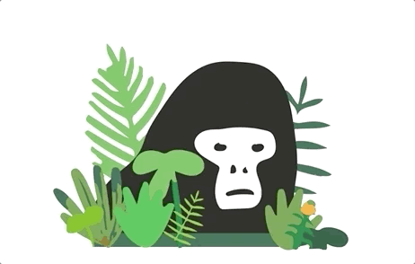

Our team decided to make the trip to Berlin for #Diffusion2019 (a blockchain hackathon) to have some fun, but more importantly take on a challenge that is often talked about, yet seldom tackled - climate change. Surely blockchain, the foundation of bitcoin, the pioneer of decentralized finance, can be extended to solve some of humanities greatest problems? This was our motivation.

After a few german beers and lots of ideation on the Friday night preceding the hackathon, we believed we had found a way to create a well incentivized, transparent carbon credit market. Overall it would be useful in stimulating carbon offset farming and combating climate change. Come on boys, lets make Greta proud!

### Supply?

Coming from South Africa, we were aware of a special plant called spekboom that is cheap, easy to grow in arid land, and very effective at offsetting carbon emissions. Why not grow spekboom in idle, arid landscapes in the karoo of South Africa to offset carbon emissions?

### Demand?

Energy use and hence emission levels are predicted to keep rising over time. Entities and individuals are interested in an easy and transparent solution to verify that they have offset their carbon emissions, and are thus carbon neutral.

### Linking supply and demand

[Carboncredits.club](https://carboncredits.club/) combines interesting economic mechanisms with cutting edge tech in order to link carbon offsetting farmers to entities worldwide in a radical new market.

- The farmers will grow hectares of spekboom plantation that will be represented as NFT's.
- Each hectare of spekboom offsets 10 tons of carbon emission per year.
- Entities/individuals will buy these spekboom NFTs, where the holder of a NFT has the right to claim the carbon offset from that particular NFT.
- When holding a spekboom NFT, erc20 tokens, called 'Carbon Credits' are automatically minted and credited to your public address over time as you hold the NFT.
- I.e. If you hold a 1 hectare spekboom NFT for 1 year, 10 carbon credits will have been minted and sent to your account (all handled transparently and programmatically through our smart contract implementation).

**Here it starts to get interesting!**

- To ensure a liquid market and incentivize the farmers, spekboom NFT's are always for sale.
- Whenever the NFT is bought, immediately the buyer must set a new selling price.
- The buyer then pays a percentage of that selling price each month toward the farmer, as a fee for holding the right to claim the carbon offset generated by that land.

Entities are finally able to 'burn' carbon credits, to verifiably and transparently show the amount (tons) of carbon they have offset.

All this results in some cool outcomes like a transparent secondary market for carbon credit trading, as well as introducing the chance for early adopters to even profit through the higher resale of their spekboom NFT's as demand for carbon credits increase.

Want to learn more? Visit [Carbon Credits](https://carboncredits.club/)

---

Remember to visit our website [Wildcards](https://wildcards.world) where you can buy some wildcards and start contributing toward at risk animal conservation today! Follow our socials to learn more about our project and the conservation causes we are working towards.

Follow us on twitter: [@wildcards_world](https://twitter.com/wildcards_world)

Follow us on Facebook: [@wildcardscrypto](https://www.facebook.com/wildcardscrypto)

Follow us on Telegram: [Telegram](https://t.me/wildcardsworld)

As always, stay cool, stay safe and stay tuned

Team Wildcards
