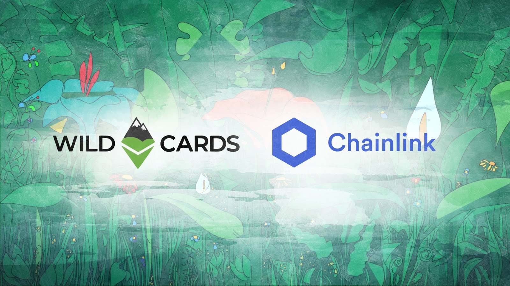
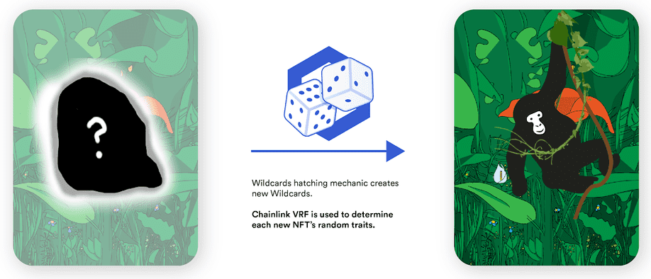
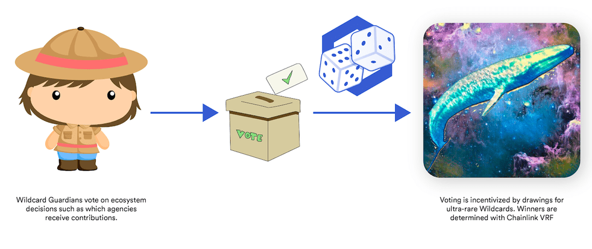

# Announcing New Wildcards Features Powered By Chainlink VRF

We’re excited today to announce a host of new features powered by our upcoming integration with Chainlink VRF! These features will expand the Wildcards ecosystem, ultimately helping us better connect global conservation organizations and users through a social, gamified, and transparent platform.

> [Wildcards](https://wildcards.world) are NFTs, with each token representing a unique animal from one of our partner conservation organizations.

Currently, every wildcard NFT is always for sale. This is because every wildcard guardian (owner) is required to set a selling price and pay a percentage of this selling price each month to our conservation partners. This concept is technically known as a Harberger tax.

`youtube:https://www.youtube.com/embed/rpQCKoRvyR4`

Our new features will be based on randomness provided by Chainlink VRF (Verifiable Randomness Function). [Chainlink VRF](https://blog.chain.link/verifiable-random-functions-vrf-random-number-generation-rng-feature/) is a randomness solution for smart contracts, providing auditable, cryptographic guarantees that each random result is unbiased and fair.

Chainlink VRF will allow us to expand the wildcards ecosystem and offer an exciting new line of collectible wildcards! We will introduce an ‘egg hatching’ mechanic in addition to our always for sale (Harberger-taxed) NFTs. We believe our users will enjoy this new collection method and populate their own virtual conservation wildernesses. We also look forward to rewarding active participants in the [Wildcards conservation DAO](https://wildcards.world/#dao) with random drawings for ultra-rare Wildcards.

## Integration Details

Chainlink VRF enables our team to introduce two new collection mechanics to the Wildcards platform. These features will increase the number of Wildcard collectibles, and incentivize Wildcard guardians to actively participate in the governance of the Wildcards ecosystem. We expect to simultaneously attract new users to the platform and encourage further participation from current members.

### Growing Wildcards supply with a hatching mechanic

Our Harberger-taxed NFTs are currently in limited supply based on our number of conservation partners and the animals they protect. With Chainlink VRF, we’ll be launching a new line of NFTs to make more Wildcards available for our users. The new collectibles will feature animals of varying rarities and breeds and be created through a randomized ‘hatching’ mechanism. The increase in the number of Wildcards will help us drive more funds towards conservation efforts.

### Loyalty token distribution and random rewards

In addition to a new line of wildcards NFTs, we will implement Chainlink VRF to incentivize Wildcards governance participation. For each day that a guardian holds a Harberger-taxed NFT, they will be rewarded with a Wildcards loyalty token. By using these tokens to vote (Quadratic Voting), they’ll have a chance at receiving an ultra-rare, randomly distributed NFT.

Chainlink VRF empowers us to enrich the Wildcards experience using provably-fair randomness. We are leveraging this solution to expand our ecosystem and achieve our goal of contributing more towards worldwide animal conservation efforts.

## About Chainlink

If you are a smart contract developer and want to take advantage of Chainlink VRF feature, visit their [developer documentation](https://docs.chain.link/docs/chainlink-vrf), and join the technical discussion on [Discord](https://discordapp.com/invite/aSK4zew). Learn more by visiting the [Chainlink website](https://chain.link/) or following them on [Twitter](https://twitter.com/chainlink) or [Reddit](https://www.reddit.com/r/Chainlink/).

Chainlink is a decentralized oracle network that enables smart contracts to securely access off-chain data feeds, web APIs, and traditional bank payments. It is well known for providing highly secure and reliable oracles to large enterprises (Google, Oracle, and SWIFT) and leading smart contract development teams such as Polkadot/Substrate, Synthetix, Loopring, Aave, OpenLaw, Conflux, and many others.

---

Visit our website [Wildcards](https://wildcards.world) where you can buy some wildcards and start contributing toward endangered animal conservation today! Follow our socials to learn more about our project and the conservation causes we are working towards.

Follow us on twitter: [@wildcards_world](https://twitter.com/wildcards_world)

Follow us on Facebook: [@wildcardscrypto](https://www.facebook.com/wildcardscrypto)

Follow us on Telegram: [Telegram](https://t.me/wildcardsworld)

As always, stay cool, stay safe and stay tuned

Team Wildcards
